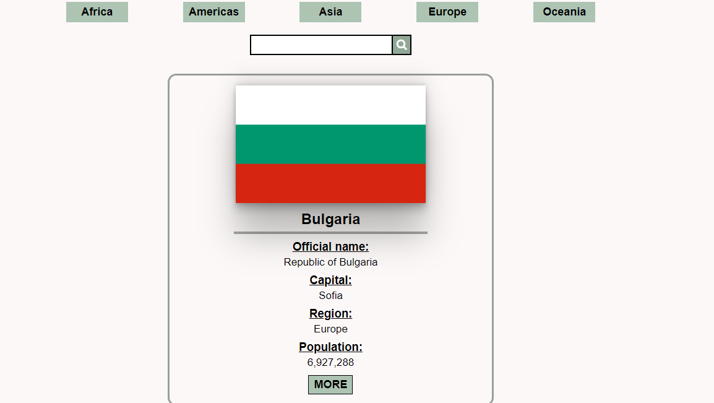

## Simple App made with React. It provides info like capital, region, currency, location on map, etc. for all countries.

### `Final result` <a href="https://country-wiki.onrender.com/" target="_blank">here</a>